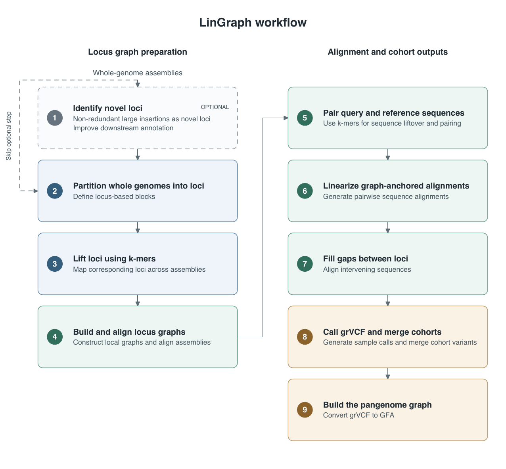

# LinGraph

**LinGraph is an assembly-based structural variant (SV) caller for challenging
repetitive regions of the genome and a pangenome graph builder. It supports
both cohort SV calling and graph construction for cohorts containing thousands
of haplotypes.** LinGraph records variant sequences and assembly coordinates
in grVCF and can export cohort calls as a pangenome graph.

## Contents

1. [Workflow overview](#workflow-overview)
2. [Installation and requirements](#installation-and-requirements)
3. [Modes and input preparation](#modes-and-input-preparation)
4. [Choose windows for graph construction](#choose-windows-for-graph-construction)
5. [Download and reconstruct Win50KGraph](#download-and-reconstruct-win50kgraph)
6. [Call one or many samples independently](#call-one-or-many-samples-independently)
7. [Call variants in a cohort](#call-variants-in-a-cohort)
8. [grVCF format and standard VCF conversion](#grvcf-format-and-standard-vcf-conversion)
9. [Build a pangenome GFA from grVCF](#build-a-pangenome-gfa-from-grvcf)
10. [Benchmark trio consistency](#benchmark-trio-consistency)

## Workflow overview



LinGraph partitions assemblies into loci, builds and aligns local graphs, and
uses those alignments to call variants. Cohort calls retain sequence and graph
relationships in grVCF and can be exported as a pangenome GFA. Novel-locus
discovery is optional. The downloadable summary below supplies precomputed
graph information for individual sample calling.

[Download the workflow figure (PDF)](scripts/docs/figures/lingraph_workflow.pdf).

## Installation and requirements

Run the examples from the repository root, which contains `readme.md`. Replace
example FASTA paths with your own files.

You need Python **3.9 or later**, Conda, `make`, and a C++17-capable compiler.
The workflows use Unix command-line tools and support local execution or SLURM.

```bash
cd /path/to/LinGraph
python3 scripts/install.py --conda-env lingraph -j 8
conda activate lingraph
export PATH="$PWD/scripts:$PATH"
python3 scripts/install.py --check-only
```

The installer creates or updates the named environment, builds the C++ tools
under `scripts/src/`, and copies the executables into `scripts/`. It installs:

| Dependency | Requirement or purpose |
| --- | --- |
| Snakemake **6.15.1**, tabulate **0.8.10** | Pinned workflow versions |
| HTSlib **≥1.19**, samtools | Indexed sequence access |
| BLAST+ **≥2.14.0**, including WindowMasker | Alignment and assembly soft masking |
| minimap2, Winnowmap2, meryl | Mapping and k-mer processing |
| bcftools | VCF normalization, compression, and indexing |
| numpy, polars ≥1.0, mappy, parasail, edlib, ssw-py | Python analysis and alignment libraries |

**Graph-alignment helpers** are included in `scripts/`, including
`graphcigarlight.py` and the BLAST/Winnowmap wrappers. The installer builds
`KmerStrd` and the other native tools. After installation, check helper discovery:

```bash
PYTHONPATH="$PWD/scripts" python3 -c 'from local_graph_whole_cigar import resolve_extension_dir; print(resolve_extension_dir())'
```

To use a separate helper installation, set `MINSETREF_GRAPH_TOOLS` to its directory.

`install.py --check-only` checks runtime dependencies without installing or
compiling. The helper check above verifies that the graph-alignment tools can
be located. Use `--no-install-deps` to build with an environment you manage yourself.

Graph mode requires at least **4 CPUs**; examples below use `-t 16`. Memory and
temporary storage needs depend on assembly count and repeat complexity. For
cohorts with thousands of haplotypes, use shared storage and the SLURM options described in
[the full command guide](scripts/LinGraph.md#slurm-and-dependencies).

## Modes and input preparation

LinGraph has two calling modes:

| Mode | Use it for | Graph input | Default alignment |
| --- | --- | --- | --- |
| `singular` | **Independent SV calling for one or many samples**; one VCF per input haplotype | An existing LinGraph graph or compact summary | `--rigorous` only |
| `graph` | Joint cohort SV calling and pangenome graph construction | Builds, resumes, or reuses a cohort graph | `--fast` |

**`singular` means independent sample calling. It supports multiple samples in
one command.** Each input haplotype is called separately using the same existing
graph and reference alignments. Use `graph` for the cohort graph-building and
calling workflow.

Both modes write **grVCF**, LinGraph's graph-aware variant format, using `.vcf`
filenames. In `graph` mode, add `--mc-graph` to export a pangenome graph as
`cohort.gfa`.

### Prepare assembly FASTAs

Use one assembly per haplotype. A diploid sample normally has two entries,
such as `HG002_h1` and `HG002_h2`. An input list has exactly two
whitespace-separated columns, with no header:

```text
HG002_h1 /data/raw/HG002.h1.fa
HG002_h2 /data/raw/HG002.h2.fa
```

Save this as `raw_assemblies.list`, then prepare the assemblies:

```bash
python3 tools/prepare_assemblies.py \
  -q raw_assemblies.list -O prepared_assemblies \
  --contignamefix -j 4
```

Preparation soft-masks unmasked inputs, fixes contig prefixes, and writes
uncompressed FASTAs with adjacent `.fai` indexes. Use the generated
`prepared_assemblies/query_paths.prepared.txt` as the calling input list.
Add `--remask` when you want to regenerate an existing mask.

Input rules:

- Names use `SAMPLE_h1`, `SAMPLE_h2`, etc. Contig identifiers use
  `SAMPLE#HAPLOTYPE#CONTIG`, for example `HG002#1#chr1`.
- Calling requires uncompressed, soft-masked FASTAs and matching `FASTA.fai`
  indexes. Preparation accepts compressed inputs.
- Relative FASTA paths are resolved from the input list's directory. Paths
  cannot contain whitespace; do not add an index column.
- **`CHM13_h1` and `HG38_h1` can keep their native contig names and masking.**
  They still need matching indexes, created with `samtools faidx reference.fa`.
- Calling checks the first sequence and index entry. Run preparation explicitly
  before calling; the calling commands do not prepare assemblies.

See [assembly preparation](tools/assembly_preparation.md) for more options.

## Choose windows for graph construction

LinGraph builds local graphs within genomic windows, also called **blocks**.
Choose one of these three options when constructing a new graph:

| Block option | Purpose and recommendation | Selection in `graph` mode |
| --- | --- | --- |
| **Gene blocks** | Use genes to define windows, making the graphs useful for annotation and phylogenetic analysis. **Recommended for pangenome graph building.** | `-b windowprofs/geneblocks.bed --bed-grouped` |
| **Balanced blocks** | Balance window sizes for slightly better SV calling accuracy. **Recommended for individual sample SV calling; a graph cache is already provided.** | `-b windowprofs/balanceblocks.bed --bed-grouped` |
| **Automatic blocks** | Let LinGraph generate its own blocks from the construction inputs. | Omit both `-b` and `--bed-grouped`. |

The supplied [gene blocks](windowprofs/geneblocks.bed) and
[balanced blocks](windowprofs/balanceblocks.bed) use **CHM13 coordinates**.
Build with the matching CHM13 reference and contig names. `-b` selects the BED
file; `--bed-grouped` preserves its supplied grouping of related windows.
Automatic blocking is the default when no BED is supplied.

The [cohort example](#call-variants-in-a-cohort) below uses gene blocks. To use
balanced blocks, replace `windowprofs/geneblocks.bed` with
`windowprofs/balanceblocks.bed`. To use automatic blocks, remove `-b` and
its BED path together with `--bed-grouped`. Use a separate graph directory for
each block choice.

For **individual sample SV calling**, download and reconstruct the provided
balanced-block graph cache, [Win50KGraph](#download-and-reconstruct-win50kgraph),
then use `singular` mode. Its windows are already defined, so no block BED is
needed when reconstructing the cache or calling new samples against it.

## Download and reconstruct Win50KGraph

**`Win50KGraph.tar.gz`** is the precomputed LinGraph graph-summary package for
the **balanced-block option**, recommended for individual sample SV calling.
It reconstructs all local graphs used in variant calling, including repetitive
regions. Download and extract it, reconstruct the graphs once, then reuse them
with `singular` mode for new haplotype assemblies.

**Figshare DOI:** [10.6084/m9.figshare.33930604](https://doi.org/10.6084/m9.figshare.33930604).
Download **`Win50KGraph.tar.gz`** (about 2.43 GB) from the Figshare record.
The download is available after the record is published and the DOI is active.

Allow additional disk space for extraction and the reconstructed graphs, and
RAM for the uncompressed reference and packed sequences during reconstruction.

### 1. Extract the summary

From the directory containing the downloaded archive:

```bash
tar -xzf Win50KGraph.tar.gz
```

The package extracts into `cohort_minsetref_v3/summary/`. Its main files are:

| File or directory | Purpose |
| --- | --- |
| `local_graphs.tsv` | Local graph definitions, source intervals, and path metadata |
| `alternatives.fasta` and `.fai` | Packed alternative and novel sequences, with their index |
| `references/CHM13_h1_rig/` | Supplied CHM13 reference alignment and block coordinates |
| `references/HG38_h1_rig/` | Supplied GRCh38 reference alignment and block coordinates |

### 2. Reconstruct all local graphs

Use the matching **CHM13 FASTA used to build the package**, with its adjacent
`.fai` index. Reconstruction reads the summary and reference; the original
cohort assemblies are not required.

```bash
python3 scripts/reconstruct_local_graph_folders.py \
  -i cohort_minsetref_v3/summary \
  -r /data/references/chm13.fa --reference-haplotype CHM13_h1 \
  -o Win50KGraph -j 16 --resume
```

This writes the local graph FASTAs, template FASTAs, BED files, BLAST databases,
and graph lists under `Win50KGraph/`. It also links `summary/` and `references/`
to the extracted package, so **keep the extracted summary in place**. Repeat
the command with `--resume` to reuse completed reconstruction outputs.

### 3. Call variants in a new sample

After preparing your query assemblies, call against CHM13:

```bash
python3 scripts/LinGraph.py singular \
  -I prepared_assemblies/query_paths.prepared.txt \
  -G Win50KGraph \
  -r /data/references/chm13.fa --reference-name CHM13_h1 \
  --reference-caches Win50KGraph/references/CHM13_h1_rig \
  -O sample_calls_chm13 -t 16
```

The explicit cache option reuses the supplied reference alignment directly;
use it with the matching reference assembly. For GRCh38 calling, use its FASTA,
`--reference-name HG38_h1`, and
`--reference-caches Win50KGraph/references/HG38_h1_rig`, with a separate output
directory. Reconstruction still uses the package's CHM13 source reference.
For another calling reference, omit `--reference-caches` so LinGraph prepares
that reference's alignments.

## Call one or many samples independently

Use `singular` to call and annotate **one sample or a batch of samples
independently** against an **existing LinGraph graph**.
Pass the graph root or its `summary/` directory with `-G`. To obtain a graph,
[download and reconstruct Win50KGraph](#download-and-reconstruct-win50kgraph)
or build one with [graph mode](#call-variants-in-a-cohort).

The examples below use `cohort_graph` as that existing graph. Reference names
such as `CHM13_h1` must occur in its saved cohort list; otherwise, supply the
reference FASTA explicitly.

### Call multiple samples in one command

List the prepared haplotype assemblies in `samples.list`. For example, two
diploid samples have four entries:

```text
HG002_h1 /data/prepared/HG002.h1.fa
HG002_h2 /data/prepared/HG002.h2.fa
HG003_h1 /data/prepared/HG003.h1.fa
HG003_h2 /data/prepared/HG003.h2.fa
```

```bash
python3 scripts/LinGraph.py singular \
  -I samples.list -G cohort_graph -r CHM13_h1 \
  -O sample_calls_chm13 -t 16
```

This independently calls all four haplotypes and writes a VCF and coverage
reports for each under `sample_calls_chm13/samples/NAME/`. The existing graph
and reference alignments are reused across inputs. By default, this command
produces separate calls; add `--merge` to also merge them after calling.

### Use CHM13, GRCh38, or another assembly as the reference

Call against CHM13:

```bash
python3 scripts/LinGraph.py singular \
  -I prepared_assemblies/query_paths.prepared.txt \
  -G cohort_graph -r CHM13_h1 -O sample_calls_chm13 -t 16
```

Call the same assemblies against GRCh38:

```bash
python3 scripts/LinGraph.py singular \
  -I prepared_assemblies/query_paths.prepared.txt \
  -G cohort_graph -r HG38_h1 -O sample_calls_hg38 -t 16
```

Use an external reference FASTA, including a reference absent from the saved
cohort:

```bash
python3 scripts/LinGraph.py singular \
  -I prepared_assemblies/query_paths.prepared.txt \
  -G cohort_graph -r /data/references/custom.fa \
  --reference-name CUSTOM_h1 -O sample_calls_custom -t 16
```

The custom reference must follow the preparation rules for `CUSTOM_h1`. For
native CHM13 or GRCh38 FASTAs, use `--reference-name CHM13_h1` or
`--reference-name HG38_h1`. You can also select any other haplotype in the saved
cohort by name, for example `-r HG002_h1`.

Omitting `-r` uses the first saved cohort assembly. Keep a separate output
directory for each reference. Changing the reference requires a new calling
run. For `HG38_h1`, the pipeline uses chr1–22, chrX, and chrY; chrM and
non-primary scaffolds are excluded.

To supply one FASTA directly, replace `-I ...` with
`-i /data/prepared/HG002.h1.fa --sample HG002_h1`.

### Reuse reference alignments

`singular` caches reference preparation under the graph root:

```text
cohort_graph/references/CHM13_h1_rig/   # singular always uses rigorous alignment
```

It first selects the rigorous directory by reference sample name,
then checks the SHA-256 hash of sorted chromosome-name/length pairs from the
first two `.fai` columns. The hash ignores FASTA contents, file names, masking,
wrapping, `.fai` row order, offsets, and timestamps. It is saved in
`reference_cache.json`. Cache metadata also tracks graph inputs, graph-list
order, and reference alignment settings. Matching results can be reused across
calling output directories and thread counts. Missing or failed stages resume
from the completed reference stages; a mismatched identity rebuilds preparation.

To use reference results you already have, add:

```bash
--reference-caches /path/to/reference-caches
```

For `-r CHM13_h1` (or `--reference-name CHM13_h1`), that directory supplies
`CHM13_h1.align.txt` and `CHM13_h1.align.txt_blocks.bed`. LinGraph uses these
files directly without reference preparation or cache, hash, mode, or content
validation. Their compatibility is the user's responsibility. The reference
FASTA and its `.fai` are still required for variant calling.

When reconstructing a graph package, `reconstruct_local_graph_folders.py` also
links `OUTPUT/references` to `INPUT/references` if that input directory exists.
It retains a matching existing link and refuses to overwrite a different destination.

### Outputs and useful options

Each input haplotype produces:

```text
sample_calls_chm13/samples/HG002_h1/
  HG002_h1.vcf
  HG002_h1.coverage.summary.tsv
  HG002_h1.coverage.missing_reference.bed
  HG002_h1.coverage.missing_query.bed
```

The coverage files report represented and uncovered assembly bases.

| Option | Effect |
| --- | --- |
| `--rigorous` / `--slow-rigorous` | Run BLASTN and Winnowmap for every query; always used in singular mode. |
| `--all` | Include SNPs, indels, and SVs of all sizes; multiple inputs also produce separate merged VCFs. |
| `--merge` | Merge calls when more than one haplotype is supplied; by default, writes `cohort.sv.vcf`. |
| `--svcutoff 50` | Set the SV size boundary to 50 bp; the default is 20 bp. |
| `-L partitions.list` | Call only the listed graph partitions; omit to use all partitions. |
| `--satellite-bed satellites.bed` | Add satellite annotations to coverage reports. |
| `--dry-run` | Check inputs and show planned commands without running or writing files. |

The default selects independent SV calling with one VCF per input haplotype.
With multiple inputs, `--merge` or an explicit variant-selection option
(`--all`, `--svonly`, `--svindel`, or `--snp`) also merges the resulting VCFs.
The calling step remains independent for each input. A single input produces
only its individual VCF. The cutoff applies to **merged representatives**;
individual `.vcf` files can retain smaller candidate events for merging.

A compact summary contains `local_graphs.tsv` and `alternatives.fasta`.
Reconstruct it with the package's source reference before selecting a different
calling reference. See the [Win50KGraph instructions](#download-and-reconstruct-win50kgraph).

## Call variants in a cohort

**Graph mode supports thousand-scale cohorts**, enabling joint SV calling and
pangenome graph construction across thousands of haplotypes.

Use `graph` to build or reuse local graphs, call the cohort, and merge its
variants. Cohort calling can be slightly faster than separate singular runs
because it reuses the cohort graph alignments. Graph mode defaults to `--fast`,
which runs BLASTN first and sends qualifying unfinished queries to Winnowmap.
Singular mode does not accept `--fast` or `--fast-mode`. Total runtime includes
graph construction when a graph is not already available.

Create `cohort.list` with the reference and prepared haplotypes:

```text
CHM13_h1 /data/references/chm13.fa
HG002_h1 /data/prepared/HG002.h1.fa
HG002_h2 /data/prepared/HG002.h2.fa
HG003_h1 /data/prepared/HG003.h1.fa
HG003_h2 /data/prepared/HG003.h2.fa
```

Build with **gene blocks**, the recommended windows for pangenome graph
construction, and call the cohort:

```bash
python3 scripts/LinGraph.py graph \
  -I cohort.list -G cohort_graph -O cohort_calls \
  -b windowprofs/geneblocks.bed --bed-grouped \
  -r CHM13_h1 --all -t 16
```

This writes individual calls to `cohort_calls/samples/NAME/NAME.vcf` and the
merged SV, indel, and SNP grVCFs to separate files in `cohort_calls/`. Choose the output contents with:

| Option | Merged output | Contents |
| --- | --- | --- |
| `--svonly` | `cohort.sv.vcf` | SV representatives at or above `--svcutoff`; default without GFA export |
| `--all` | `cohort.sv.vcf`, `cohort.indel.vcf`, `cohort.snp.vcf` | SNPs, indels, and SVs of all sizes; default with `--mc-graph` |
| `--svindel` | `cohort.sv.vcf` and `cohort.indel.vcf` | SVs split at the cutoff, without SNPs |
| `--snp` | `cohort.snp.vcf` | SNPs only |

Keep `-G` and `-O` **separate and non-nested**. Repeat the same command to resume
completed work and retry unfinished stages. A completed graph retains its
cohort list, so `-I` can then be omitted.

Useful additions:

- `--rigorous`: use both aligners for every query during graph alignment.
- `--static-block`: retain initial templates and skip additional novel-locus
  discovery and refinement. Calling and merging still run.
- `--slurm --slurm-jobs 20 --slurm-args '--account=myaccount --partition=compute'`:
  submit workflow jobs through SLURM. Activate the environment before launching.

For existing results, use `--merge-only` to merge saved individual VCFs, or
`--recall-only` to regenerate VCFs and merge from saved calling alignments. For
example, to add small variants to a previous SV-only calling run:

```bash
python3 scripts/LinGraph.py graph -G cohort_graph -O cohort_calls \
  -r CHM13_h1 --recall-only --all -t 16
```

Recall requires the saved alignments and calling inputs. See
[cohort calling](scripts/cohort_call_snakemake/README.md) for restart and merge details.

## grVCF format and standard VCF conversion

### What grVCF stores

grVCF preserves information needed to describe variation within repetitive and
non-reference sequence. It uses the familiar VCF columns (`CHROM`, `POS`, `ID`,
`REF`, `ALT`, `QUAL`, `FILTER`, `INFO`, `FORMAT`, and sample columns), with extra
graph-aware annotations. LinGraph currently writes these files with a `.vcf`
extension, including individual and merged outputs.

A merged row describes one **representative allele**. Each haplotype's FORMAT
fields retain its supporting observations and how they relate to that allele.
This preserves variation both on the chosen reference and within alternative,
novel, or inserted sequence, including variants nested inside other alleles.

Two downstream uses are supported:

| Goal | Input and tool |
| --- | --- |
| Use reference-based VCF software | Convert grVCF with `tools/grvcf_to_vcf.py` |
| Build a pangenome graph | Pass the original grVCFs to `merged_vcf_to_gfa.py` or use `LinGraph.py graph --gfa-only` |

### Main fields

| Field | Meaning |
| --- | --- |
| `ALT` | SNP bases or symbolic alleles such as `<INS>`, `<DEL>`, and `<SUB>` (replacement). |
| `INFO/SVTYPE`, `END`, `SVLEN` | Event type, endpoint, and representative signed length. |
| `INFO/SEQ` | Representative inserted/replacement sequence, which may be graph encoded. |
| `INFO/EXTENDGRAPHCIGAR` | Representative alignment encoding, including graph targets when present. |
| `FORMAT/GT` | Haplotype call: `1` supports the variant, `0` is callable reference, `.` is no call. |
| `FORMAT/TYPE`, `SIZE` | Each observation's event type and signed size. |
| `FORMAT/EXTENDGRAPHCIGAR` | Each observation's alignment to the representative. |
| `FORMAT/BASE` | Observed alternate base for a SNP. |
| `FORMAT/ASSEMBLYCONTIG`, `QUERYCOORD` | Original assembly contig and zero-based query coordinate/range with strand. |
| `FORMAT/TEMPLATEOFFSET` | Signed displacement from the row's `POS` to an observation's breakpoint. |
| `FORMAT/ALLELENAME`, `LABEL_H` | Source allele and local graph provenance. |

The new FORMAT layout exposes these annotations as separate named fields.
Multiple observations are comma-separated in matching order across the
per-observation fields; they do not represent extra genotype copies. The older
packed `HSV` and `HSNP` layouts remain supported by the converter.

For example, the default SV FORMAT is:

```text
GT:TYPE:SIZE:EXTENDGRAPHCIGAR:ASSEMBLYCONTIG:QUERYCOORD:TEMPLATEOFFSET:ALLELENAME:LABEL_H
```

`TEMPLATEOFFSET=5` means that observation's breakpoint lies five bases after
the row's displayed `POS`. Thus a merged site retains the individual
breakpoints as well as its representative allele. Optional provenance fields
may be omitted by the calling options; always read the record's FORMAT column.

**Coordinates need care.** SNP positions are one-based. Symbolic variants on
reference or supplied template sequences describe the interval `[POS, END)`;
an insertion has `END=POS`, and a boundary can be zero. Nested variants can use
an insertion allele ID as `CHROM`; their default `POS` is the insertion offset
plus one. Graph CIGARs can reference other alleles or named FASTA sequences.
These details are resolved by LinGraph's converters.

### Convert to standard VCF

Use **`tools/grvcf_to_vcf.py`** with the same reference FASTA used for calling
and its adjacent `.fai` index. This example converts the SV file; repeat for
the indel and SNP files with distinct output names:

```bash
python3 tools/grvcf_to_vcf.py \
  -i cohort_calls/cohort.sv.vcf \
  -r /data/references/chm13.fa \
  -o cohort_calls/cohort.sv.standard.vcf
```

Individual grVCFs and merged `.sv.vcf`, `.indel.vcf`, and `.snp.vcf` files are
accepted, including gzip-compressed inputs and older combined `.all.vcf`
files. Convert one file per invocation. The converter:

- Writes explicit REF/ALT bases, adds indel padding, checks the reference, and
  sorts records. A `<SUB>` becomes one replacement allele.
- Preserves sample names, genotype ploidy/phasing, missing calls, IDs, QUAL,
  and FILTER. It replaces graph annotations with `GT` and recalculated
  `AC`, `AN`, `AF`, and `NS`.
- Converts the merged representative allele. Supporting observations and their
  `TEMPLATEOFFSET` values are not expanded into separate alleles.
- Preserves rows whose `CHROM` is absent from the reference FASTA in
  `OUTPUT.unplaced.gr.vcf`. Use `--unplaced FILE` to choose that path. These
  graph-only calls remain available in their original coordinate system.

If encoded sequences reference additional graph or alternative FASTAs, supply
each indexed catalog with `-a`. For normalized, compressed output:

```bash
python3 tools/grvcf_to_vcf.py \
  -i cohort_calls/cohort.sv.vcf \
  -r /data/references/chm13.fa \
  -a cohort_graph/summary/alternatives.fasta \
  -o cohort_calls/cohort.sv.standard.vcf.gz --normalize
```

`--normalize` uses `bcftools norm` for left alignment. A `.vcf.gz` output uses
BGZF compression and gets a `.csi` index; both options require bcftools.
All supplied FASTAs need `.fai` indexes. Use `--force` to replace existing
outputs. Keep the original grVCF for graph construction and detailed annotation.

Auxiliary FASTAs supply sequence for decoding; they do not project graph-only
coordinates onto the chosen reference. Check the conversion summary's
`converted` and `unplaced` counts, and retain the unplaced grVCF alongside the
standard VCF. Encoded alleles referring to other variant IDs need those
definitions in the input grVCF, or the corresponding named sequences in an
auxiliary FASTA. Missing sequence dependencies or reference mismatches stop
conversion with an error.

See [the converter guide](tools/README.md#convert-grvcf-to-standard-vcf) or run
`python3 tools/grvcf_to_vcf.py --help` for all conversion options.

## Build a pangenome GFA from grVCF

Graph export uses the **original merged grVCFs**, their graph annotations, and
the matching assembly sequences to create a pangenome `.gfa` file. Keep these
grVCFs when converting copies to standard VCF: standard conversion removes
information needed for graph reconstruction.

### Export through LinGraph

To export the merged SV, indel, and SNP VCFs produced above without calling or merging again:

```bash
python3 scripts/LinGraph.py graph -G cohort_graph -O cohort_calls \
  -r CHM13_h1 --gfa-only --all -t 16
```

The output is **`cohort_calls/cohort.gfa`**. Use the same graph, reference, and
variant-selection mode as the calling run. Keep its original assembly FASTAs,
indexes, and saved template files available: graph export needs their sequences.

To build with gene blocks, call the cohort, and export the GFA in one run, add
`--mc-graph`:

```bash
python3 scripts/LinGraph.py graph \
  -I cohort.list -G cohort_graph -O cohort_calls \
  -b windowprofs/geneblocks.bed --bed-grouped \
  -r CHM13_h1 --all --mc-graph -t 16
```

The default export is **rGFA**, a GFA graph with stable sequence coordinates.
It includes the reference backbone and branches for the selected SNPs, indels,
and SVs. Its named paths describe source sequences and variant alleles.

- `--all` retains variants of all sizes. Use `--svonly --svcutoff 50` for
  an SV-only export, or `--insertion-only 50` to retain insertions of at least 50 bp.
- `--max-node-length` sets the maximum segment length; the default is 1,024 bases.
- An explicit `-r` selects that haplotype as the backbone. Without `-r`, export
  uses `GRAPH/inputs/reference_alternatives_novels.fa`, the combined catalog of
  reference, alternative, and novel sequences.

### Convert grVCF files directly

To select the input files explicitly, use `merged_vcf_to_gfa.py`. A cohort run
with `--all` produces three files; pass all three so nested variants can resolve
their parent alleles across files:

```bash
python3 scripts/merged_vcf_to_gfa.py \
  -v cohort_calls/cohort.sv.vcf \
     cohort_calls/cohort.indel.vcf \
     cohort_calls/cohort.snp.vcf \
  -q cohort.list \
  -r /data/references/chm13.fa --reference-haplotype CHM13_h1 \
  --graph-folder cohort_graph \
  --local-reference-templates cohort_calls/checkpoints/local_reference_templates.fa \
  --local-path-fasta cohort_graph/summary/alternatives.fasta \
  --all --processes 16 -o cohort_calls/cohort.gfa
```

`cohort.list` must map VCF sample names to their original prepared FASTAs.
The reference and template files must match the calling run. All sequence
FASTA inputs need adjacent `.fai` indexes. The local path catalog resolves graph
coordinates; the lifted template file supplies placements relative to the
selected reference. Use `--local-path-fasta` for the summary catalog, since
`-a` instead adds entire FASTA records as extra graph paths.

The converter writes GFA segments (`S`), links (`L`), and named paths (`P`),
with rGFA tags recording sequence origins and offsets. SNPs and inserted or
replacement sequences form branches; deletions connect across skipped sequence.
BED and mapping sidecars accompany the GFA for tracing coordinates. Use
`--validate-only` to check sequence and topology without writing a GFA.

See [the GFA export guide](scripts/merged_vcf_to_gfa.md) for coordinate conventions,
additional filters, and graph validation.

## Benchmark trio consistency

The [benchmark directory](benchmark/README.md) provides two tools for checking
whether child variants have a match in either parent:

- **[QuickTriocheck.py](benchmark/QuickTriocheck.README.md):** compare separate
  haplotype VCFs or one multi-sample VCF using position, variant type, and size.
  Requires only Python's standard library.
- **[truvari_trio.sh](benchmark/truvari_trio.README.md):** run eight pairwise
  Truvari benchmarks for two child and four parental haplotypes.

Each guide explains requirements, coverage filtering, commands, and outputs.
Use calls made against the same reference and retain their coverage headers.

## Repository layout

```text
readme.md
scripts/                 Main pipeline scripts and installation helper
  graph_build_snakemake/ Graph-building workflow
  cohort_call_snakemake/ Cohort-calling workflow
  src/                   C++ sources
  docs/figures/          Workflow figure (PNG and PDF)
tools/                   Preparation and VCF conversion utilities
windowprofs/             Gene and balanced block-interval BED files
benchmark/               Trio benchmarks and a README for each script
tests/                   Regression tests
```

Run the trio-reporting regression tests with:

```bash
python3 -m unittest discover -s tests -v
```

Compile the native tools during installation; platform-specific binaries are
not included.

## More help

```bash
python3 scripts/LinGraph.py --help
python3 scripts/LinGraph.py singular --help-all
python3 scripts/LinGraph.py graph --help-all
```

For advanced options, compact graph packages, and SLURM execution, see
[the full LinGraph guide](scripts/LinGraph.md).
