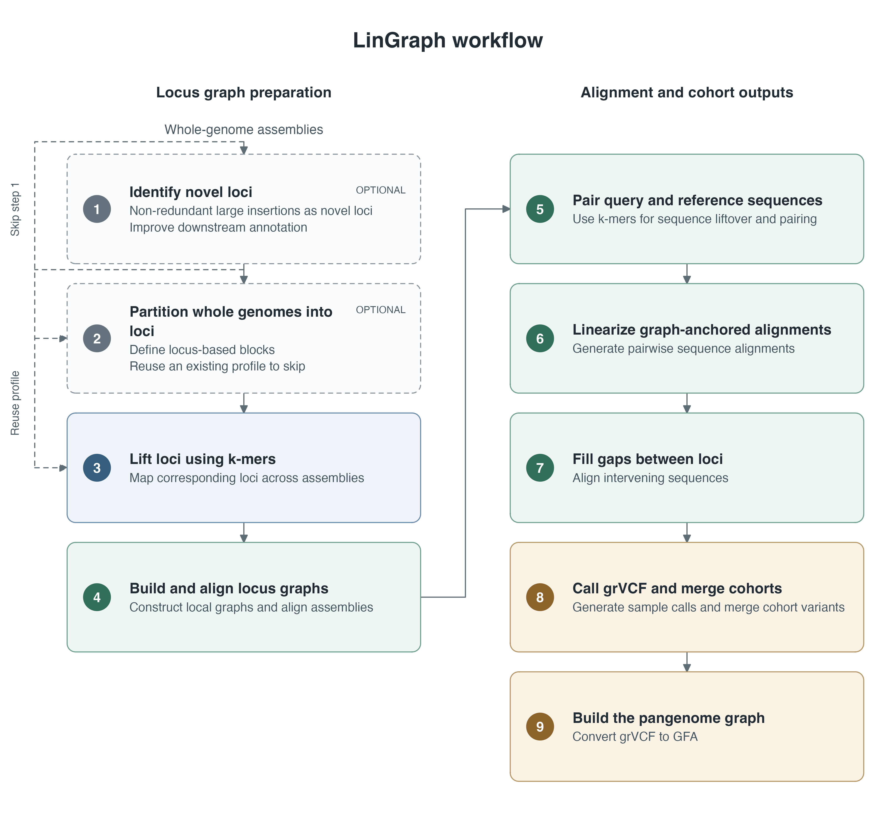

# LinGraph

LinGraph is a variant-guided **pangenome graph builder** and an
**assembly-based structural variant (SV) caller**. It takes haplotype-resolved
genome assemblies and produces:

- **VCFs** (in grVCF, a lossless graph-aware VCF) of SNPs, indels, and SVs for
  each haplotype, or merged across a cohort;
- a **pangenome graph** (`cohort.gfa`) with one GAF path file per sample, built
  from the merged cohort calls.

LinGraph has two run modes:

| I want to... | Mode | What I need |
| --- | --- | --- |
| Call variants in my own assemblies against an existing graph | `individual` | Prepared assemblies, a reference FASTA, and a graph (download the precomputed **Win50KGraph**) |
| Build a new pangenome graph and call a cohort together | `graph` | Prepared assemblies for the whole cohort and a reference FASTA |

New users who just want VCFs: follow
[Quick start A](#quick-start-a-call-variants-in-your-assemblies).

## Contents

1. [Quick start A: call variants in your assemblies](#quick-start-a-call-variants-in-your-assemblies)
2. [Quick start B: build a cohort pangenome graph](#quick-start-b-build-a-cohort-pangenome-graph)
3. [Commands at a glance](#commands-at-a-glance)
4. [Workflow overview](#workflow-overview)
5. [Installation and requirements](#installation-and-requirements)
6. [Prepare assembly FASTAs](#prepare-assembly-fastas)
7. [Individual mode: call samples independently](#individual-mode-call-samples-independently)
8. [Graph mode: build a pangenome graph from a cohort](#graph-mode-build-a-pangenome-graph-from-a-cohort)
9. [Output files](#output-files)
10. [Running on SLURM, resuming, and recovering](#running-on-slurm-resuming-and-recovering)
11. [grVCF format and standard VCF conversion](#grvcf-format-and-standard-vcf-conversion)
12. [Build a pangenome GFA from grVCF](#build-a-pangenome-gfa-from-grvcf)
13. [Benchmark trio consistency](#benchmark-trio-consistency)
14. [Questions and answers](#questions-and-answers)
15. [Repository layout and more help](#repository-layout)

## Quick start A: call variants in your assemblies

This route calls one diploid sample (two haplotype assemblies) against CHM13
using the precomputed Win50KGraph. Run every command from the LinGraph
repository root. Replace the paths under `/data/...` with your own files.
For a complete, step-by-step individual-calling walkthrough, see the
[HG002 on CHM13 demo](demo/HG002_CHM13/README.md), which also shows how to
reuse graph alignments when switching references.

**Before you start**, you need:

- your two haplotype assemblies (FASTA, plain or compressed);
- the CHM13 reference FASTA used to build Win50KGraph, with its `.fai` index
  (`samtools faidx chm13.fa`);
- about 2.5 GB for the download, plus disk space for the extracted package and
  the reconstructed graphs.

**Step 1. Install** (once; see [Installation](#installation-and-requirements)):

```bash
python3 install.py --conda-env lingraph -j 8
```

```bash
conda activate lingraph
```

After activation, use `python` for every LinGraph command. It is the
environment's interpreter, and SLURM stages inherit it.

**Step 2. List your assemblies** in a two-column file, `raw_assemblies.list`
(haplotype name, FASTA path; no header):

```text
HG002_h1 /data/raw/HG002.h1.fasta
HG002_h2 /data/raw/HG002.h2.fasta
```

Name each haplotype `SAMPLE_h1`, `SAMPLE_h2`, and so on. Each name must be
unique in the list.

**Step 3. Prepare the assemblies.** This soft-masks them, renames contigs to the
required `SAMPLE#N#CONTIG` form, and indexes them:

```bash
python scripts/LinGraph.py prepare \
  -q raw_assemblies.list -O prepared_assemblies --contignamefix -t 16
```

For inputs that are not already soft-masked, most preparation time is spent
masking repeats with WindowMasker, so this step can take a while for
whole-genome assemblies.

With two haplotypes, `-t 16` prepares both at once with about 8 WindowMasker
processes each. The prepared list is written to
`prepared_assemblies/query_paths.prepared.txt`.

**Step 4. Download and unpack Win50KGraph** (once):

```bash
curl -L -C - https://ndownloader.figshare.com/files/69451449 -o Win50KGraph.tar.gz
```

```bash
tar -xzf Win50KGraph.tar.gz
```

**Step 5. Reconstruct the local graphs** (once; reuse them for every later sample):

```bash
python scripts/reconstruct_local_graph_folders.py \
  -i cohort_minsetref_v3/summary \
  -r /data/references/chm13.fa --reference-haplotype CHM13_h1 \
  -o Win50KGraph -j 16 --resume
```

Keep `cohort_minsetref_v3/` in place: `Win50KGraph/` links to it.

**Step 6. Call variants:**

```bash
python scripts/LinGraph.py individual \
  -I prepared_assemblies/query_paths.prepared.txt \
  -G Win50KGraph \
  -r /data/references/chm13.fa --reference-name CHM13_h1 \
  --reference-caches Win50KGraph/references/CHM13_h1_rig \
  -O HG002_calls -t 16
```

**Result:** one VCF per haplotype, `HG002_calls/samples/HG002_h1/HG002_h1.vcf`
and `HG002_calls/samples/HG002_h2/HG002_h2.vcf`, with coverage reports beside
them. Add `--merge` to also write merged `cohort.sv.vcf`, `cohort.indel.vcf`,
and `cohort.snp.vcf` files. To use the calls with standard VCF tools, see
[Convert to standard VCF](#convert-to-standard-vcf).

Tips:

- Add `--dry-run` to any command to check the inputs and print the plan
  without running anything.
- If a run stops, **repeat the same command**: finished work is reused.
- Calling takes about 1 hour per haplotype on 64 cores.

## Quick start B: build a cohort pangenome graph

This route builds a new graph from a cohort, calls all haplotypes together, and
exports the pangenome GFA. Install and prepare the assemblies as in
[steps 1–3 above](#quick-start-a-call-variants-in-your-assemblies), listing every
haplotype in the cohort. For a complete cohort example—including GFA/GAF
losslessness checks and trio benchmarking—follow the
[NA19240 trio graph demo](demo/NA19240trio_graph/README.md). If you only want
individual SV calls with the precomputed Win50KGraph, see the
[NA19240 trio SV-calling demo](demo/NA19240trio_SVcall/README.md).

**Step 1. Create `cohort.list`** with the reference first, then every prepared
haplotype:

```text
CHM13_h1 /data/references/chm13.fa
HG002_h1 /data/prepared/HG002_h1.fa
HG002_h2 /data/prepared/HG002_h2.fa
HG003_h1 /data/prepared/HG003_h1.fa
HG003_h2 /data/prepared/HG003_h2.fa
```

`CHM13_h1` and `HG38_h1` keep their native contig names and need only a `.fai`
index. You can paste the rows from `prepared_assemblies/query_paths.prepared.txt`
below the reference line.

**Step 2. Build the graph, call the cohort, and export the GFA:**

```bash
python scripts/LinGraph.py graph \
  -I cohort.list -G cohort_graph -O cohort_calls \
  -b windowprofs/geneblocks.bed --bed-grouped \
  -r CHM13_h1 --alternative data/alternatives.fa \
  --exact --make-graph -t 16
```

| Option | Meaning |
| --- | --- |
| `-G cohort_graph` | Where the graph is built and saved; reuse it for later runs |
| `-O cohort_calls` | Where the VCFs and the GFA are written; keep it separate from `-G` and not nested inside it |
| `-b windowprofs/geneblocks.bed --bed-grouped` | Use the supplied gene blocks (recommended for graph building) |
| `--alternative data/alternatives.fa` | Add the recommended catalog of alternative sequences missing from CHM13 |
| `--exact` | Merge the cohort calls exactly (the default; shown for clarity) |
| `--make-graph` | Also export `cohort.gfa` and the per-sample GAFs |

**Result:** in `cohort_calls/`, the merged `cohort.sv.vcf`, `cohort.indel.vcf`,
and `cohort.snp.vcf`; per-haplotype VCFs under `samples/NAME/`; `cohort.gfa`;
and per-sample GAFs under `gaf/`. Graph mode needs at least 4 CPUs; a full
cohort run should have 32 CPUs and 64 GB RAM or more. For large cohorts, add
[SLURM options](#running-on-slurm-resuming-and-recovering).

## Commands at a glance

All commands run from the repository root as `python scripts/LinGraph.py ...`.

| Task | Command |
| --- | --- |
| Prepare assemblies | `LinGraph.py prepare -q raw.list -O prepared --contignamefix` |
| Call samples independently | `LinGraph.py individual -I samples.list -G GRAPH -r REF -O OUT` |
| …and merge them | add `--merge` |
| Call one FASTA | `LinGraph.py individual -i asm.fa --sample HG002_h1 -G GRAPH -r REF -O OUT` |
| Build a reference cache only | `LinGraph.py individual -G GRAPH -r ref.fa --reference-only -O OUT` |
| Build a graph and call a cohort | `LinGraph.py graph -I cohort.list -G GRAPH -O OUT -r REF --exact` |
| …and export the GFA | add `--make-graph` |
| Switch the backbone of a finished graph | `LinGraph.py graph -G GRAPH -O NEW_OUT -r OTHER_HAP --exact --make-graph` |
| Export the GFA from existing merged VCFs | `LinGraph.py graph -G GRAPH -O OUT -r REF --gfa-only` |
| Re-merge existing per-sample VCFs | add `--merge-only` |
| Recall and merge from saved alignments | `LinGraph.py graph -G GRAPH -O OUT -r REF --recall-only --exact` |
| Preview without running | add `--dry-run` |
| Clear locks after an interrupted run | `LinGraph.py --unlock GRAPH OUT` |
| Convert grVCF to standard VCF | `python tools/grvcf_to_vcf.py -i in.vcf -o out.vcf` |
| Rename CHM13 contigs to `chr1`... | `python tools/vcf_chromfix.py -i in.vcf -o out.vcf --CHM13fix` |
| Show all options | `LinGraph.py individual --help-all`, `LinGraph.py graph --help-all` |

## Workflow overview



LinGraph divides the genome into blocks (loci). For each block, it builds a
small local graph from the assemblies, aligns each assembly to it, and calls
variants from those alignments. The calls are then joined back onto the
reference. Cohort calls keep their sequence and graph relationships in grVCF
and can be exported as a pangenome GFA. Novel-locus discovery is optional.

- `individual` reuses an existing graph, such as the downloadable Win50KGraph,
  and calls each haplotype on its own.
- `graph` builds (or resumes) the graph from the cohort assemblies and calls
  the cohort as part of that build.

[Download the workflow figure (PDF)](figures/lingraph_workflow.pdf).

## Installation and requirements

You need Python **3.9 or later**, Conda, `make`, and a C++17-capable compiler.
The workflows use Unix command-line tools and run locally or on SLURM.

```bash
cd /path/to/LinGraph
python3 install.py --conda-env lingraph -j 8
conda activate lingraph
python install.py --check-only
```

Optionally, put the scripts on your `PATH` with `export PATH="$PWD/scripts:$PATH"`.

The installer creates or updates the named Conda environment, builds the C++
tools under `scripts/src/`, and copies the executables into `scripts/`. It
installs:

| Dependency | Requirement or purpose |
| --- | --- |
| Snakemake **6.15.1**, tabulate **0.8.10** | Pinned workflow versions |
| HTSlib **≥1.19**, samtools | Indexed sequence access |
| BLAST+ **≥2.14.0**, including WindowMasker | Alignment and assembly soft masking |
| minimap2, Winnowmap2, meryl | Mapping and k-mer processing |
| bcftools | VCF normalization, compression, and indexing |
| numpy, polars ≥1.0, mappy, parasail, edlib, ssw-py | Python analysis and alignment libraries |

Installer options:

- `--check-only` checks runtime dependencies without installing or compiling.
- `--no-install-deps` builds against an environment you manage yourself.

The **graph-alignment helpers** (`graphcigarlight.py`, the BLAST/Winnowmap
wrappers, and the natively built `KmerStrd` and other tools) are in `scripts/`.
To check that they are found:

```bash
PYTHONPATH="$PWD/scripts" python -c 'from local_graph_whole_cigar import resolve_extension_dir; print(resolve_extension_dir())'
```

To use a separate helper installation, set `MINSETREF_GRAPH_TOOLS` to its
directory.

**Compute resources.** Graph mode requires at least **4 CPUs**; the examples
use `-t 16`. For a full cohort run, we recommend **32 CPUs and at least 64 GB
RAM**. Larger cohorts or high repeat complexity may need more memory and
temporary storage. For cohorts with thousands of haplotypes, use shared storage
and [SLURM](#running-on-slurm-resuming-and-recovering).

## Prepare assembly FASTAs

LinGraph needs each haplotype as **one uncompressed, soft-masked FASTA with an
adjacent `.fai` index**, and every contig named **`SAMPLE#N#CONTIG`**. The
preparation command does all of this for you.

### 1. Write the assembly list

One haplotype per row, two whitespace-separated columns, no header:

```text
HG002_h1 /data/raw/HG002.h1.raw.fasta
HG002_h2 /data/raw/HG002.h2.raw.fasta
```

The list name `HG002_h1` (underscore, `h`) corresponds to the contig prefix
`HG002#1#` (`#` separators). For example, the raw header `>chr1` of `HG002_h1`
becomes `>HG002#1#chr1`.

### 2. Run preparation

```bash
python scripts/LinGraph.py prepare \
  -q raw_assemblies.list -O prepared_assemblies \
  --contignamefix -t 16
```

This is the same as `python tools/prepare_assemblies.py` with the same options.
It soft-masks unmasked inputs with WindowMasker, adds missing contig prefixes,
and writes uncompressed FASTAs with `.fai` indexes. Without `-j`, `-t` is the
total CPU budget shared across the inputs; for a two-haplotype sample, `-t 16`
uses two preparations at once with about 8 masking processes each. The source
FASTAs are not changed. **Use `prepared_assemblies/query_paths.prepared.txt`
as the input list for calling.**

| Option | Effect |
| --- | --- |
| `-q LIST` / `-i FASTA --name HG002_h1` | Prepare a list, or a single FASTA |
| `-O DIR` | Output folder for prepared FASTAs, indexes, and the new list |
| `--contignamefix` | Add the `SAMPLE#N#` prefix to contigs that lack it |
| `--remask` | Regenerate soft masking even if the FASTA is already masked |
| `-t THREADS` | Total CPU budget, shared across inputs unless `-j` is set |
| `-j JOBS` | Set the number of assemblies at once; with `-j`, `-t` is masking processes per assembly (about `-j × -t` CPUs) |

To fix contig names only, without masking:

```bash
python tools/namecontigsfix.py -i assembly.fa -n HG002_h1
samtools faidx assembly.namefixed.fa
```

This writes `assembly.namefixed.fa` (use `-o` to choose another path). `-n`
accepts `HG002_h1` or `HG002#1`.

### Input rules

- **Every haplotype name in the first column must be unique across the whole
  list.** Two rows named `HG002_h1` make inputs and outputs ambiguous and can
  attribute one assembly's results to another.
- A contig must belong to exactly one haplotype. Do not nest prefixes, such as
  `HG002#1#HG002#2#chr1`; the name fixer rejects this. Correct the source
  header or the list label instead.
- **`CHM13_h1` and `HG38_h1` keep their native contig names and masking.** They
  only need an index: `samtools faidx reference.fa`.
- Preparation accepts compressed inputs; calling requires the uncompressed,
  indexed output.
- Relative FASTA paths are resolved from the list's directory. Paths cannot
  contain whitespace. Do not add an index column.
- Calling checks the first sequence and index entry and stops if the input is
  not prepared. `--force-prepare` instead prepares temporary copies (see
  [the input format question](#why-is-a-specific-input-assembly-format-required-and-what-is-it)).

See [assembly preparation](tools/assembly_preparation.md) for more options.

## Individual mode: call samples independently

`individual` calls **one sample or a batch of samples, each haplotype
independently**, against an **existing LinGraph graph** passed with `-G`. You
can either:

- [download and reconstruct Win50KGraph](#get-the-win50kgraph-graph) (recommended), or
- build your own graph with [graph mode](#graph-mode-build-a-pangenome-graph-from-a-cohort).

### Get the Win50KGraph graph

**`Win50KGraph.tar.gz`** is the precomputed LinGraph graph summary built with
**balanced blocks**, recommended for individual SV calling. It reconstructs all
local graphs used for calling, including repetitive regions. You reconstruct it
once and reuse it for every new sample.

**Figshare DOI:** [10.6084/m9.figshare.33930604](https://doi.org/10.6084/m9.figshare.33930604)
(file `Win50KGraph.tar.gz`, about 2.43 GB). The download is available after the
record is published and the DOI is active.

**1. Download and extract.** In the folder where you want the archive
(`-C -` resumes an interrupted download):

```bash
curl -L -C - https://ndownloader.figshare.com/files/69451449 -o Win50KGraph.tar.gz
tar -xzf Win50KGraph.tar.gz
```

The package extracts into `cohort_minsetref_v3/summary/`:

| File or directory | Purpose |
| --- | --- |
| `local_graphs.tsv` | Local graph definitions, source intervals, and path metadata |
| `alternatives.fasta` and `.fai` | Packed alternative and novel sequences, with their index |
| `references/CHM13_h1_rig/` | Supplied CHM13 reference alignment and block coordinates |
| `references/HG38_h1_rig/` | Supplied GRCh38 reference alignment and block coordinates |

The archive holds the graph summary, not the full graph, so reconstruct it
before calling.

**2. Reconstruct all local graphs.** Use the **CHM13 FASTA used to build the
package**, with its `.fai` index. The original cohort assemblies are not needed.

```bash
python scripts/reconstruct_local_graph_folders.py \
  -i cohort_minsetref_v3/summary \
  -r /data/references/chm13.fa --reference-haplotype CHM13_h1 \
  -o Win50KGraph -j 16 --resume
```

This writes local graph FASTAs, template FASTAs, BED files, BLAST databases,
and graph lists under `Win50KGraph/`. It also links `summary/` and
`references/` to the extracted package, so **keep the extracted package in
place**. If interrupted, repeat the command; `--resume` reuses finished
outputs. Reconstruction needs extra disk space, and RAM for the uncompressed
reference and packed sequences.

**3. Call variants.** Against CHM13, reusing the supplied reference alignment:

```bash
python scripts/LinGraph.py individual \
  -I prepared_assemblies/query_paths.prepared.txt \
  -G Win50KGraph \
  -r /data/references/chm13.fa --reference-name CHM13_h1 \
  --reference-caches Win50KGraph/references/CHM13_h1_rig \
  -O sample_calls_chm13 -t 16
```

For GRCh38, use the GRCh38 FASTA, `--reference-name HG38_h1`,
`--reference-caches Win50KGraph/references/HG38_h1_rig`, and a separate `-O`.
For any other reference, omit `--reference-caches` and LinGraph aligns that
reference itself (see [Add another reference](#add-another-reference-hg19-example)).
Reconstruction always uses the package's CHM13 reference, whichever reference
you call against.

### Call multiple samples in one command

List the prepared haplotypes in `samples.list`. Two diploid samples have four
rows:

```text
HG002_h1 /data/prepared/HG002_h1.fa
HG002_h2 /data/prepared/HG002_h2.fa
HG003_h1 /data/prepared/HG003_h1.fa
HG003_h2 /data/prepared/HG003_h2.fa
```

```bash
python scripts/LinGraph.py individual \
  -I samples.list -G cohort_graph -r CHM13_h1 \
  -O sample_calls_chm13 -t 16
```

Each of the four haplotypes is called independently and gets its own VCF and
coverage reports under `sample_calls_chm13/samples/NAME/`. The graph and the
reference alignment are shared across inputs. Add `--merge` to also merge the
calls into cohort VCFs.

To call a single FASTA without a list, replace `-I ...` with
`-i /data/prepared/HG002_h1.fa --sample HG002_h1`.

### Choose the reference

`-r` takes either a **haplotype name** saved in the graph's cohort list or a
**FASTA path**. Use a separate `-O` for each reference.

| Reference | Option |
| --- | --- |
| CHM13 or GRCh38 saved in the graph | `-r CHM13_h1` or `-r HG38_h1` |
| Any other haplotype saved in the graph | `-r HG002_h1` |
| An external FASTA | `-r /data/references/custom.fa --reference-name CUSTOM_h1` |
| Default (no `-r`) | The first assembly in the graph's saved cohort list |

```bash
python scripts/LinGraph.py individual \
  -I prepared_assemblies/query_paths.prepared.txt \
  -G cohort_graph -r HG38_h1 -O sample_calls_hg38 -t 16
```

Notes:

- An external reference must follow the [preparation rules](#prepare-assembly-fastas)
  for its name, except native CHM13 or GRCh38 FASTAs, which you name with
  `--reference-name CHM13_h1` or `--reference-name HG38_h1`.
- For `HG38_h1`, LinGraph uses chr1–22, chrX, and chrY; chrM and non-primary
  scaffolds are excluded.
- Changing the reference requires a new calling run. To call the same
  assemblies against another reference faster, add
  `--reuse-alignments PREVIOUS_OUTPUT` to reuse their graph alignments from an
  earlier run with the same graph.

### Add another reference: HG19 example

A graph can call against any reference once that reference's cache exists in
`GRAPH/references/NAME_rig`. Win50KGraph ships caches for `CHM13_h1` and
`HG38_h1`. This example builds one for HG19 (UCSC, chr1–22, X and Y).

**1. Download and prepare HG19.** A reference other than CHM13 or GRCh38 needs
the `NAME#1#` prefix, so `--contignamefix` renames `chr1` to `HG19#1#chr1`:

```bash
mkdir -p logs references && cd references
curl -L -O https://hgdownload.soe.ucsc.edu/goldenPath/hg19/bigZips/hg19.fa.gz
gzip -dc hg19.fa.gz > hg19.fa
samtools faidx hg19.fa
samtools faidx hg19.fa chr{1..22} chrX chrY > hg19_main.fa
python ../LinGraph/tools/prepare_assemblies.py \
  -i hg19_main.fa --name HG19_h1 -O hg19 \
  --contignamefix --remask --threads 16 > ../logs/prepare_hg19.log 2>&1
cd ..
```

**2. Build the reference cache once.** `--reference-only` aligns the reference
to every local graph (this takes hours, like calling one haplotype), writes
`Win50KGraph/references/HG19_h1_rig`, and calls no samples. If a different
HG19 already uses that name, the cache goes to `HG19_h1_<fingerprint>_rig`
instead. Rerun the same command to resume:

```bash
python LinGraph/scripts/LinGraph.py individual \
  -G Win50KGraph -r references/hg19/hg19_main.fa \
  --reference-only -O hg19_cache -t 64 > logs/hg19_cache.log 2>&1
```

The name `HG19_h1` is read from the contig prefix; add
`--reference-name HG19_h1` to state it explicitly. To keep the cache elsewhere,
add `--reference-caches DIR` here and to later calls. If you skip this step,
the first HG19 call builds the cache in its own output folder.

**3. Call against HG19.** The cache is found and reused automatically:

```bash
python LinGraph/scripts/LinGraph.py individual \
  -I prepared_assemblies/query_paths.prepared.txt \
  -G Win50KGraph -r references/hg19/hg19_main.fa \
  -O sample_calls_hg19 -t 64 > logs/calls_hg19.log 2>&1
```

VCF records use the prepared names, such as `HG19#1#chr1`. To restore plain
names, see [Reference contig names](#reference-contig-names).

### How reference caches are found

Calling needs a **reference cache**: the reference aligned to every local
graph. Caches live in folders such as `GRAPH/references/CHM13_h1_rig/`, each
with a `reference_cache.json` that records the reference name, the alignment
mode, and a **contig fingerprint**: the SHA-256 of the sorted
chromosome-name/length pairs from the `.fai`. The fingerprint ignores FASTA
contents, file names, masking, line wrapping, `.fai` row order, offsets, and
timestamps.

`individual` finds the cache automatically:

1. It checks `GRAPH/references/NAME_rig`, then
   `GRAPH/references/NAME_<fingerprint>_rig` (the first 12 characters of the
   reference's fingerprint). It uses the first complete cache with the same
   reference name, mode, and fingerprint, and prints the folder it matched.
2. Without a match, it builds the cache in `OUTPUT/references/NAME_rig`.
   Rerunning with the same `-O` resumes or reuses it.

`--reference-caches DIR` overrides this search. For `-r CHM13_h1` (or
`--reference-name CHM13_h1`), `DIR` must supply `CHM13_h1.align.txt` and
`CHM13_h1.align.txt_blocks.bed`. LinGraph uses these files directly, **without
any name, fingerprint, mode, or content check**, so make sure they match the
reference. The reference FASTA and its `.fai` are still required.

When reconstructing a graph package, `reconstruct_local_graph_folders.py` links
`OUTPUT/references` to `INPUT/references` if that folder exists. It keeps a
matching existing link and refuses to overwrite a different one.

### Individual-mode options

| Option | Effect |
| --- | --- |
| `--merge` | With several haplotypes, also merge them into `cohort.sv.vcf`, `cohort.indel.vcf`, and `cohort.snp.vcf` |
| `--all` / `--svonly` / `--svindel` / `--snp` | Choose which merged VCFs to write (all; SVs only; SVs and indels; SNPs only). Any of these also turns on merging |
| `--svcutoff 50` | SV size boundary for merged files (default 20 bp) |
| `-L partitions.list` | Call only the listed graph partitions (default: all) |
| `--satellite-bed satellites.bed` | Add satellite annotations to coverage reports |
| `--reuse-alignments DIR` | Reuse graph alignments from an earlier run with the same graph |
| `--force-prepare` | Prepare temporary copies of unprepared inputs instead of stopping |
| `--slurm` | Run one SLURM job per haplotype (see [SLURM](#running-on-slurm-resuming-and-recovering)) |
| `--dry-run` | Check inputs and show planned commands without running or writing files |

Calling is always independent per haplotype; merging is an extra step after
calling, and a single input never produces merged files. The size cutoff
applies to **merged representatives**, so the per-haplotype `.vcf` files can
keep smaller candidate events for merging.

## Graph mode: build a pangenome graph from a cohort

**Graph mode builds (or resumes) a pangenome graph and calls the cohort as part
of the build.** It scales to thousands of haplotypes. Use it to build a fresh
graph; use `individual` when you already have a graph and want per-sample VCFs.

### 1. Create the cohort list

List the reference and every prepared haplotype:

```text
CHM13_h1 /data/references/chm13.fa
HG002_h1 /data/prepared/HG002_h1.fa
HG002_h2 /data/prepared/HG002_h2.fa
HG003_h1 /data/prepared/HG003_h1.fa
HG003_h2 /data/prepared/HG003_h2.fa
```

### 2. Choose the blocks

Graph building divides the genome into blocks. The supplied BEDs in
`windowprofs/` use CHM13 coordinates, so use them with a CHM13 reference:

| Blocks | Option | Use |
| --- | --- | --- |
| Gene blocks | `-b windowprofs/geneblocks.bed --bed-grouped` | **Recommended for graph building**; block edges follow genes |
| Balanced blocks | `-b windowprofs/balanceblocks.bed --bed-grouped` | Slightly better SV calling; used by Win50KGraph |
| Automatic | omit `-b` and `--bed-grouped` | LinGraph chooses blocks from the inputs |

See [What are local graphs?](#what-are-local-graphs-and-how-are-they-made) for the
trade-offs.

### 3. Run the build

```bash
python scripts/LinGraph.py graph \
  -I cohort.list -G cohort_graph -O cohort_calls \
  -b windowprofs/geneblocks.bed --bed-grouped \
  -r CHM13_h1 --alternative data/alternatives.fa --exact --make-graph -t 16
```

- `--exact` is the default merge: it uses the indexed assemblies to realign
  merged SVs.
- `--make-graph` also exports `cohort.gfa` and the per-sample GAFs. Omit it to
  produce only the VCFs; you can [export the GFA later](#export-through-lingraph).
- Keep `-G` and `-O` **separate and not nested**. A completed graph saves its
  cohort list, so later runs on it can omit `-I`.
- Repeat the same command to resume after an interruption.

### Recommended alternatives for CHM13

[data/alternatives.fa](data/alternatives.fa) is the recommended catalog of
alternative sequences to use with CHM13 (via `--alternative`). Its `.fai` index
is included; if you edit or replace the FASTA, regenerate it with
`samtools faidx data/alternatives.fa`.

The catalog complements CHM13; it does not replace the reference FASTA or its
row in `cohort.list`. Imported alternatives become part of the saved graph
inputs, so use the same catalog when resuming a build.

### Choose or change the reference (backbone)

The reference (`-r`) is the backbone used for variant calling and graph output.
It can be **any haplotype in `cohort.list`**, named exactly as in its first
column. Without `-r`, LinGraph uses the first row.

To build with `HG002_h2` as the backbone:

```bash
python scripts/LinGraph.py graph \
  -I cohort.list -G cohort_graph -O cohort_calls_HG002_h2 \
  -b windowprofs/geneblocks.bed --bed-grouped \
  -r HG002_h2 --exact --make-graph -t 16
```

To produce results on **another backbone after a run has completed**, reuse the
same `-G`, omit `-I` and the construction options, change `-r`, and use a new
`-O`:

```bash
python scripts/LinGraph.py graph \
  -G cohort_graph -O cohort_calls_HG003_h1 \
  -r HG003_h1 --exact --make-graph -t 16
```

LinGraph reuses the saved local graph alignments and reruns only the
reference-dependent steps (matching, lifting, VCF, merge, and GFA). Use a
normal `graph` run for this; `--recall-only` keeps the previous run's reference
and cannot change backbones.

### Rerun parts of a finished run

| Goal | Option |
| --- | --- |
| Export the GFA from existing merged VCFs | `--gfa-only` |
| Re-merge saved per-sample VCFs | `--merge-only` (add `--make-graph` to also export) |
| Regenerate VCFs and merge from saved calling alignments | `--recall-only` |
| Keep the initial templates and skip extra novel-locus discovery | `--static-block` |

For example, to regenerate the exact merged cohort outputs:

```bash
python scripts/LinGraph.py graph -G cohort_graph -O cohort_calls \
  -r CHM13_h1 --recall-only --exact -t 16
```

`--recall-only` requires the saved alignments and calling inputs. The `--all`,
`--svonly`, `--svindel`, and `--snp` options mainly select VCF contents for
individual runs; they do not control graph construction. See
[cohort calling](scripts/cohort_call_snakemake/README.md) for restart and merge
details.

## Output files

| File | Mode | Contents |
| --- | --- | --- |
| `OUT/samples/NAME/NAME.vcf` | both | Calls for one haplotype (grVCF) |
| `OUT/samples/NAME/NAME.coverage.summary.tsv` | individual | Assembly bases represented and uncovered |
| `OUT/samples/NAME/NAME.coverage.missing_reference.bed`, `NAME.coverage.missing_query.bed` | individual | Uncovered reference and assembly intervals |
| `OUT/cohort.sv.vcf`, `cohort.indel.vcf`, `cohort.snp.vcf` | graph; individual with `--merge` | Merged cohort calls (grVCF) |
| `OUT/cohort.gfa` | graph with `--make-graph` | Pangenome graph (rGFA) |
| `OUT/gaf/SAMPLE.gaf` | graph with `--make-graph` | Each sample's paths through the graph (`OUT/gaf/gaf_stats.tsv` summarizes them) |
| `OUT/checkpoints/local_reference_templates.fa`, `alternative_loci.fa` | graph | [Alternative and novel sequences](#where-do-i-find-the-alternative-and-novel-sequences) for this reference (individual mode writes them under `samples/NAME/`) |
| `OUT/lingraph/` | both | Run record (`run.json`), logs, and checkpoints |

Keep the original grVCFs: graph export, merging, and the converters need them.
See [the full command guide](scripts/LinGraph.md#outputs-and-restarting) for
every output.

## Running on SLURM, resuming, and recovering

**SLURM.** Activate the environment first, then add `--slurm` and your
`sbatch` options:

```bash
python scripts/LinGraph.py graph \
  -I cohort.list -G cohort_graph -O cohort_calls -r CHM13_h1 --exact \
  --slurm --slurm-jobs 20 --slurm-args '--account=myaccount --partition=compute'
```

In `individual` mode, `--slurm` runs one job per haplotype (up to
`--slurm-jobs` at once, default 20). In `graph` mode, it submits the workflow
stages as jobs. Memory defaults and options are listed in
[the memory question](#how-much-memory-is-used-and-how-do-i-increase-it-after-an-out-of-memory-failure).

**Resuming.** Repeat the same command. Finished stages are reused and only
unfinished or failed ones run again.

**Stale locks.** If a run was killed, clear its workflow locks after all of its
jobs have exited, then repeat the command:

```bash
python scripts/LinGraph.py --unlock cohort_graph cohort_calls
```

Unlocking keeps checkpoints and outputs; add `--dry-run` to preview it.

**Previewing.** `--dry-run` validates inputs and prints the planned commands
without creating files or submitting jobs.

## grVCF format and standard VCF conversion

See the [Graph Recursive VCF (grVCF) guide](docs/LinGraph_Graph_Recursive_VCF.pdf)
for the CIGAR and recursive representations, nested variants, and validation.

### What grVCF stores

grVCF keeps the information needed to describe variation in repetitive and
non-reference sequence. It uses the usual VCF columns (`CHROM`, `POS`, `ID`,
`REF`, `ALT`, `QUAL`, `FILTER`, `INFO`, `FORMAT`, and sample columns) plus
graph-aware annotations. LinGraph writes these files with a `.vcf` extension,
for both individual and merged outputs.

A merged row describes one **representative allele**: the largest insertion of
its group, but the smallest deletion. Row IDs are unique:

| ID | Record |
| --- | --- |
| `I_...`, `D_...` | Insertions and deletions |
| `S_<chrom>_<pos>_<alt>` | SNPs |
| `<I\|D>_<parent>_<pos>_<size>` | A nested variant; its `CHROM` is the parent row's ID. Insertions of different bases at one position and size get `a`, `b`, ... appended |

Each haplotype's FORMAT fields keep its supporting observations and how they
relate to the representative allele. This preserves variation on the reference
and within alternative, novel, or inserted sequence, including variants nested
inside other alleles.

There are two downstream uses:

| Goal | Input and tool |
| --- | --- |
| Use reference-based VCF software | Convert with `tools/grvcf_to_vcf.py` |
| Build a pangenome graph | Pass the original grVCFs to `merged_vcf_to_gfa.py`, or use `LinGraph.py graph --gfa-only` |

### Main fields

| Field | Meaning |
| --- | --- |
| `ALT` | SNP bases or symbolic alleles such as `<INS>`, `<DEL>`, and `<SUB>` (replacement). |
| `INFO/SVTYPE`, `END`, `SVLEN` | Event type, endpoint, and representative signed length. |
| `INFO/SEQ` | Representative inserted/replacement sequence, which may be graph encoded. |
| `INFO/EXTENDGRAPHCIGAR` | Representative alignment encoding, including graph targets when present. |
| `FORMAT/GT` | Haplotype call: `1` supports the variant, `0` is callable reference, `.` is no call. |
| `FORMAT/TYPE`, `SIZE` | Each observation's event type and signed size. |
| `FORMAT/EXTENDGRAPHCIGAR` | Each observation's alignment to the representative. |
| `FORMAT/BASE` | Observed alternate base for a SNP. |
| `FORMAT/ASSEMBLYCONTIG`, `QUERYCOORD` | Original assembly contig and zero-based query coordinate/range with strand. |
| `FORMAT/TEMPLATEOFFSET` | Signed displacement from the row's `POS` to an observation's breakpoint. |
| `FORMAT/ALLELENAME`, `LABEL_H` | Source allele and local graph provenance. |

Multiple observations in one sample are comma-separated, in the same order
across the per-observation fields; they are not extra genotype copies. The
older packed `HSV` and `HSNP` layouts are still supported by the converter.

The default SV FORMAT is:

```text
GT:TYPE:SIZE:EXTENDGRAPHCIGAR:ASSEMBLYCONTIG:QUERYCOORD:TEMPLATEOFFSET:ALLELENAME:LABEL_H
```

`TEMPLATEOFFSET=5` means that observation's breakpoint lies five bases after
the row's `POS`, so a merged site keeps the individual breakpoints as well as
its representative allele. Optional provenance fields may be omitted depending
on the calling options; always read each record's FORMAT column.

**Coordinates need care.** SNP positions are one-based. Symbolic variants on
reference or template sequences describe the interval `[POS, END)`; an
insertion has `END=POS`, and a boundary can be zero. Nested variants use an
insertion's row ID as `CHROM`, and their default `POS` is the offset inside the
insertion plus one. Graph CIGARs can reference other alleles or named FASTA
sequences. LinGraph's converters resolve these details.

### Reference contig names

LinGraph names reference contigs so that chromosomes of different references
never share a name (`chr1` of GRCh38, CHM13, and HG19 are different sequences,
and one graph can use several references):

| Reference | Contig names in VCFs |
| --- | --- |
| CHM13 | NCBI RefSeq accessions, `NC_060925.1` ... `NC_060948.1` |
| GRCh38 | `chr1` ... `chrY` |
| Any other reference or assembly | `NAME#N#` prefix, such as `HG19#1#chr1` or `HG002#1#chr1` |

VCF records, `##contig` lines, and coverage headers use these names. To get
plain chromosome names, rename the **finished** VCFs with `tools/vcf_chromfix.py`
(nested rows keep pointing at their parents):

```bash
# CHM13: NC_060925.1 ... NC_060948.1 -> chr1 ... chr22, chrX, chrY
python tools/vcf_chromfix.py -i cohort.sv.vcf -o cohort.sv.chr.vcf --CHM13fix
# Other references: HG19#1#chr1 -> chr1
python tools/vcf_chromfix.py -i cohort.sv.vcf -o cohort.sv.chr.vcf --noprefix
```

Rename the indel and SNP files the same way. Keep the original files as input
to LinGraph's merge, GFA export, and converters, because they match the
prepared FASTA names. See the
[renaming guide](tools/README.md#rename-reference-chromosomes-in-a-vcf) for
`--fixtable` and other options.

### Known incompatibility: records at POS 0

Some records have `POS=0`: an insertion before the first base of its sequence,
usually a nested variant at the very start of its parent allele. grVCF allows a
zero boundary, but standard VCF positions start at 1, so some tools mishandle
these records. With bcftools/htslib 1.22, for example, `bcftools view` and
`bcftools sort` accept them, but `tabix` warns `Coordinate <= 0`, region queries
(`-r`) skip them, and `bcftools norm` reports a REF mismatch. LinGraph's own
tools read them correctly, and `tools/grvcf_to_vcf.py` removes them when it
exports a standard VCF.

### Convert to standard VCF

`tools/grvcf_to_vcf.py` exports a plain VCF in one streaming pass, without a
reference FASTA. Convert one file at a time:

```bash
python tools/grvcf_to_vcf.py \
  -i cohort_calls/cohort.sv.vcf \
  -o cohort_calls/cohort.sv.standard.vcf
```

Repeat for the indel and SNP files. Plain and gzip-compressed inputs are
accepted; write `.vcf.gz` for BGZF output (requires `bgzip`; no index is
created). `--force` replaces an existing output.

What the converter does:

- **Removes** nested records (on `I_`, `D_`, `SUB_`, or `DUP_` parents;
  `INS_`/`DEL_` in older runs) and records at `POS=0`.
- Converts `<INS>` with a plain `INFO/SEQ` into explicit bases (`ALT=REF+SEQ`).
  Other symbolic alleles, including insertions with graph-encoded sequence,
  stay symbolic.
- Keeps record order, IDs, REF, QUAL, FILTER, sample names, and GT. INFO keeps
  only `SVTYPE`, `END`, `SVLEN`, and `NSUP`; FORMAT keeps only GT.
- Does **not** validate against a reference, normalize or sort alleles,
  compute allele frequencies, or write an unplaced-record sidecar. Records on
  alternative loci keep their original coordinate system.

This is a representative-allele export, **not a lossless assembly export**.
Keep the original grVCF for nested variation and graph construction. Check the
reported `written`, `nested_removed`, and `position_zero_removed` counts before
using the output. The legacy `-r` option is accepted but ignored; `-a` and
`--normalize` are not supported. See
[the converter guide](tools/README.md#convert-grvcf-to-standard-vcf) or
`python tools/grvcf_to_vcf.py --help`.

## Build a pangenome GFA from grVCF

Graph export uses the **original merged grVCFs** and their graph annotations to
build `cohort.gfa`; the bases come from the grVCFs and the reference, template,
and catalog FASTAs, never from the assemblies. Converting copies to
standard VCF removes information needed here, so keep the grVCFs.

### Export through LinGraph

To export the merged cohort VCFs of a finished run, without calling or merging
again:

```bash
python scripts/LinGraph.py graph -G cohort_graph -O cohort_calls \
  -r CHM13_h1 --gfa-only -t 16
```

The output is **`cohort_calls/cohort.gfa`**, plus the per-sample GAFs under
`cohort_calls/gaf/`. Use the same graph, reference, and merged VCFs as the
calling run, and keep the saved template files and the graph's catalog FASTAs
(with their `.fai` indexes) available. The export runs the C++ tool
`GrvcfGraph` (built by `install.py`), which writes the GFA and every sample's
GAF in one assembly-free pass; `--svonly` merges are not supported. To do
everything in one run instead, add `--make-graph` to the
[build command](#3-run-the-build).

The default export is **rGFA**, a GFA with stable sequence coordinates. It
contains the reference backbone and branches for the SNPs, indels, and SVs; its
named paths are the source sequences, and the `SN`/`SO` tags of each variant's
segments name its allele.

- `--gaf-threads N` sets how many samples are walked at once for the GAFs
  (default: `-t`); each holds about 400 bytes per carried allele.
- `--max-node-length` sets the maximum segment length (default 1,024 bases).
- An explicit `-r` makes that haplotype the backbone. Without `-r`, export uses
  `GRAPH/inputs/reference_alternatives_novels.fa`, the combined catalog of
  reference, alternative, and novel sequences.

### Convert grVCF files directly

To choose the input files yourself, run `merged_vcf_to_gfa.py`. Pass the SV,
indel, and SNP files of an exact cohort run together so nested variants can
find their parent alleles across files. Here, `--all` tells the converter that
all three categories are supplied.

```bash
python scripts/merged_vcf_to_gfa.py \
  -v cohort_calls/cohort.sv.vcf \
     cohort_calls/cohort.indel.vcf \
     cohort_calls/cohort.snp.vcf \
  -q cohort.list \
  -r /data/references/chm13.fa --reference-haplotype CHM13_h1 \
  --graph-folder cohort_graph \
  --local-reference-templates cohort_calls/checkpoints/local_reference_templates.fa \
  --local-path-fasta cohort_graph/summary/alternatives.fasta \
  --all --processes 16 -o cohort_calls/cohort.gfa
```

Requirements:

- `cohort.list` maps the VCF sample names to their original prepared FASTAs.
- The reference and template files match the calling run.
- Every FASTA input has an adjacent `.fai` index.
- `--local-path-fasta` supplies the summary catalog that resolves graph
  coordinates. (`-a` instead adds whole FASTA records as extra graph paths.)

The converter writes GFA segments (`S`), links (`L`), and named paths (`P`),
with rGFA tags recording sequence origins and offsets. SNPs and inserted or
replacement sequences form branches; deletions connect across the skipped
sequence. BED and mapping sidecars accompany the GFA for tracing coordinates.
Use `--validate-only` to check sequence and topology without writing a GFA.
See [the GFA export guide](scripts/merged_vcf_to_gfa.md) for coordinate
conventions, filters, and validation.

## Benchmark trio consistency

The [benchmark directory](benchmark/README.md) has two tools that check whether
child variants are found in either parent:

- **[QuickTriocheck.py](benchmark/QuickTriocheck.README.md):** compares separate
  haplotype VCFs or one multi-sample VCF by position, variant type, and size.
  Needs only Python's standard library.
- **[truvari_trio.sh](benchmark/truvari_trio.README.md):** runs eight pairwise
  Truvari benchmarks for two child and four parental haplotypes.

Each guide explains requirements, coverage filtering, commands, and outputs.
Use calls made against the same reference and keep their coverage headers.

## Questions and answers

### Why is a specific input assembly format required, and what is it?

Each haplotype is one uncompressed, soft-masked FASTA with an adjacent `.fai`
index, and every contig is named `SAMPLE#N#CONTIG` (for example `HG002#1#chr1`
for `HG002_h1`); see [Prepare assembly FASTAs](#prepare-assembly-fastas). The
prefix keeps every contig name unique across all assemblies of a run, so each
call can be traced back to its contig in the original assembly; plain names
such as `chr1` would collide between assemblies. Soft masking helps the
aligners.

If inputs are not in this format, LinGraph stops and prints a preparation
command for each one. With `--force-prepare`, it instead prepares copies in
`OUTPUT/PreparedAssemblies/` (in parallel, sharing `-t`) and deletes them when
the run finishes. This needs
temporary disk space for a full copy of each prepared assembly. It is fine for
a few samples; for a large cohort, prepare the assemblies beforehand.

### What are local graphs, and how are they made?

Local graphs divide and conquer graph building and SV calling. The genome is
divided into blocks; each block's sequences from all assemblies form one small
local graph, which is built, aligned, and called on its own, and the results
are joined back on the reference.

Two block profiles are provided in `windowprofs/` (both in CHM13 coordinates,
used with `-b BED --bed-grouped`):

1. **Balanced blocks** (`balanceblocks.bed`): chosen automatically to optimize
   the local alignments and avoid breakpoints in repeats. Better for SV calling
   (about 0.1–0.2% fewer errors, a 10–20% improvement). Win50KGraph uses these
   blocks.
2. **Gene blocks** (`geneblocks.bed`): adjusted to gene coordinates, which helps
   gene-based downstream work such as genotyping with ctyper. **Highly
   recommended when building a graph.** SV calling is slightly less accurate
   because block edges can fall in repeats, but the extra errors are generally
   in tandem repeats, not gene bodies.

### How long does a run take?

About **1 hour per haplotype on 64 cores** for individual calling. Merging
depends on the cohort size but usually adds 10–20% of the calling time. With
`--slurm`, haplotypes are called in parallel (up to `--slurm-jobs`, default 20).

### How much memory is used, and how do I increase it after an out-of-memory failure?

Locally, LinGraph uses the machine's memory. With `--slurm`:

| Job | Default memory | Increase with |
| --- | --- | --- |
| `individual`: one job per haplotype (and the `--merge` job) | 64G | `--slurm-memory` |
| `graph`: per-sample matching, lifting, graph CIGAR, gap filling, VCF | 32G each | `--match-memory`, `--genomelift-memory`, `--graphcigar-memory`, `--gapfill-memory`, `--vcf-memory` |
| `graph`: cohort extraction and local templates | 64G | `--extraction-memory` |
| `graph`: run-once merge scans, concats, publish, GFA export | 64G below 100 sample VCFs, 128G from 100 on | `--slurm-memory` |
| `graph`: per-chromosome merge jobs | 2G per CPU below 100 samples, 64G from 100 on (chr1 doubled) | `--merge-memory` |
| `graph`: novel-locus discovery | 128G | `--novel-slurm-memory` |

To find the failed job, run `sacct -j JOBID` (state `OUT_OF_MEMORY`) and check
the logs under `OUTPUT/lingraph/`. Then repeat the same command with the larger
memory option; finished stages are reused and only the failed ones run again.
See `--help-all` for every per-stage option.

### How do I output versions of the graph with different references as the backbone?

Run `graph` again with the same `-G`, a different `-r` (any haplotype in the
cohort list), a new `-O`, and `--make-graph`. Saved local graph alignments are
reused; only the reference-dependent steps run again. See
[Choose or change the reference](#choose-or-change-the-reference-backbone).

### How are non-reference sequences represented in the VCF?

At three levels:

1. **Alternatives**: novel genes found in open-source assemblies, supplied
   with `--alternative` (for example `data/alternatives.fa`).
2. **Novel loci**: large insertions found in the cohort, usually novel
   immune-related genes.
3. **Insertions**: called dynamically in each sample. Variants inside an
   inserted sequence are nested rows whose `CHROM` is the insertion's row ID.

### Where do I find the alternative and novel sequences?

Which sequences count as alternative or novel depends on the linear reference:
a sequence absent from CHM13 can be present in GRCh38. So each calling run
writes the sequences for its own `-r` reference:

| Run | Files |
| --- | --- |
| `graph` | `OUTPUT/checkpoints/local_reference_templates.fa` and `OUTPUT/checkpoints/alternative_loci.fa` |
| `individual` | `OUTPUT/samples/NAME/local_reference_templates.fa` and `OUTPUT/samples/NAME/alternative_loci.fa` |

VCF rows not placed on the reference are reported on these sequences. Each
record header also records where it lifts onto the reference
(`reference=CONTIG:START-END:STRAND`), or `lift_status=unmapped`. Runs from
before `alternative_loci.fa` was added have only `local_reference_templates.fa`.

The graph itself keeps every local graph path that is not an exact slice of its
construction reference in `GRAPH/summary/alternatives.fasta`. When a graph is
built:

- `GRAPH/inputs/reference_alternatives.fa` holds the reference with the
  supplied alternatives;
- `GRAPH/novel_loci.fa` holds the discovered novel loci (with `--find-novel-loci`);
- `GRAPH/inputs/reference_alternatives_novels.fa` holds all of them together.

Supplied alternatives are tagged `sequence_role=imported_alternative` in their
headers.

### How are duplicated genes represented?

By a primary alignment, reported as an insertion, and an alternative alignment
to the closest reference gene.

### How do I convert grVCF to a normal VCF?

Use `tools/grvcf_to_vcf.py`; see [Convert to standard VCF](#convert-to-standard-vcf).

### How do I add my own samples to known VCFs?

1. Call your samples with `individual`, using the same graph and reference as
   the known VCFs.
2. Split the known merged grVCFs (exact or CIGAR version) into one grVCF per
   sample; each sample's call is rebuilt from the CIGAR in its sample fields:

   ```bash
   python tools/convert_merged_grvcf.py split \
     -v known/cohort.sv.vcf known/cohort.indel.vcf known/cohort.snp.vcf \
     -r reference.fa -o known_individual
   ```

3. List the split grVCFs and your samples' grVCFs in `all_vcfs.list`, then merge
   them into new merged grVCFs:

   ```bash
   python tools/merge_grvcfs.py -I all_vcfs.list -O merged_new -t 16
   ```

See [the tools guide](tools/README.md#split-merged-grvcfs-or-convert-between-exact-and-cigar)
for `--exact` merging and other options.

### Which regions are not included?

1. Regions with N gaps.
2. The edges of scaffolds.
3. Constitutive heterochromatin and other simple repeats longer than 1 Mb.

Check each haplotype's coverage report, `samples/NAME/NAME.coverage.summary.tsv`,
and the uncovered intervals in `NAME.coverage.missing_reference.bed` and
`NAME.coverage.missing_query.bed`.

## Repository layout

```text
readme.md
install.py               Root installer entry point
scripts/                 Main pipeline scripts and installer implementation
  LinGraph.py            Main command (prepare, individual, graph)
  graph_build_snakemake/ Graph-building workflow
  cohort_call_snakemake/ Cohort-calling workflow
  src/                   C++ sources
figures/                 Workflow figure (PNG and PDF)
data/                    Recommended CHM13 alternatives and FASTA index
docs/                    Format and usage guides
tools/                   Preparation and VCF conversion utilities
windowprofs/             Gene and balanced block-interval BED files
benchmark/               Trio benchmarks and a README for each script
tests/                   Regression tests
```

Native tools are compiled during installation; platform-specific binaries are
not included. Run the trio-reporting regression tests with:

```bash
python -m unittest discover -s tests -v
```

## More help

```bash
python scripts/LinGraph.py --help
python scripts/LinGraph.py individual --help-all
python scripts/LinGraph.py graph --help-all
python scripts/LinGraph.py prepare --help
```

For advanced options, compact graph packages, and SLURM execution, see
[the full LinGraph guide](scripts/LinGraph.md).
